author: Álvaro Caro Fernández
summary: Guía para bastionar el arranque de un sistema Debian
id: Proyecto 1.2
categories: codelab,markdown
environments: Web
status: Publicado

# Guía para bastionar el arranque de un sistema Debian

## ÍNDICE
- [Introducción](#introducción)
- [Actualizar el sistema](#actualizar-el-sistema)
- [Configurar GRUB para mejorar la seguridad](#configurar-grub-para-mejorar-la-seguridad)
- [Proteger el acceso a GRUB con contraseña](#proteger-el-acceso-a-grub-con-contraseña)
- [Configurar AppArmor (Opcional)](#configurar-apparmor-opcional)
- [Deshabilitar servicios innecesarios al arranque](#deshabilitar-servicios-innecesarios-al-arranque)
- [Monitorear los Logs de Arranque](#monitorear-los-logs-de-arranque)
- [Conclusión](#conclusión)


## Introducción
Bastionar el arranque de un sistema Debian es un proceso fundamental para mejorar la seguridad desde el momento en que el equipo se enciende. El arranque es una fase crítica en la que el sistema carga su núcleo y los servicios esenciales, y, si no está debidamente protegido, podría ser vulnerable a ataques o accesos no autorizados.

Esta guía ofrece una serie de pasos y configuraciones para asegurar el arranque en sistemas Debian. Desde la actualización y configuración del gestor de arranque (GRUB), AppArmor y otros métodos de control de acceso, esta guía proporciona un enfoque integral para proteger tanto el proceso de inicio como el acceso a la información almacenada en el sistema.

Es importante tener en cuenta que estas medidas no solo dificultan el acceso no autorizado, sino que también refuerzan la integridad del sistema, manteniendo los datos a salvo y asegurando que el entorno operativo esté preparado ante posibles amenazas.

<br>

## Actualizar el sistema
Mantener el sistema actualizado es el primer paso esencial para cualquier medida de seguridad, ya que asegura que las últimas correcciones de seguridad y mejoras de rendimiento estén instaladas.

**Comando:**
```bash
sudo apt update && sudo apt upgrade -y
```
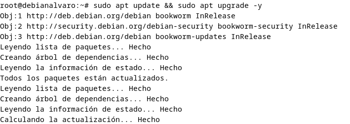

**Descripción:**
- ```apt update``` actualiza la lista de paquetes disponibles.

- ```apt upgrade -y``` instala las actualizaciones para todos los paquetes instalados sin preguntar.

- Se debe ejecutar esto regularmente para mantener el sistema seguro y actualizado.

<br>

## Configurar GRUB para mejorar la seguridad

GRUB es el gestor de arranque en Debian, y es el primer programa que se carga cuando enciendes el sistema. Podemos modificar su configuración para restringir el acceso no autorizado y mejorar la privacidad durante el arranque.

**Pasos:**

Abrir el archivo de configuración de GRUB:
```bash
sudo nano /etc/default/grub
```

<br>
Añadir o modificar las siguientes líneas:

```bash
GRUB_CMDLINE_LINUX="quiet splash"

GRUB_DISABLE_OS_PROBER=true
```

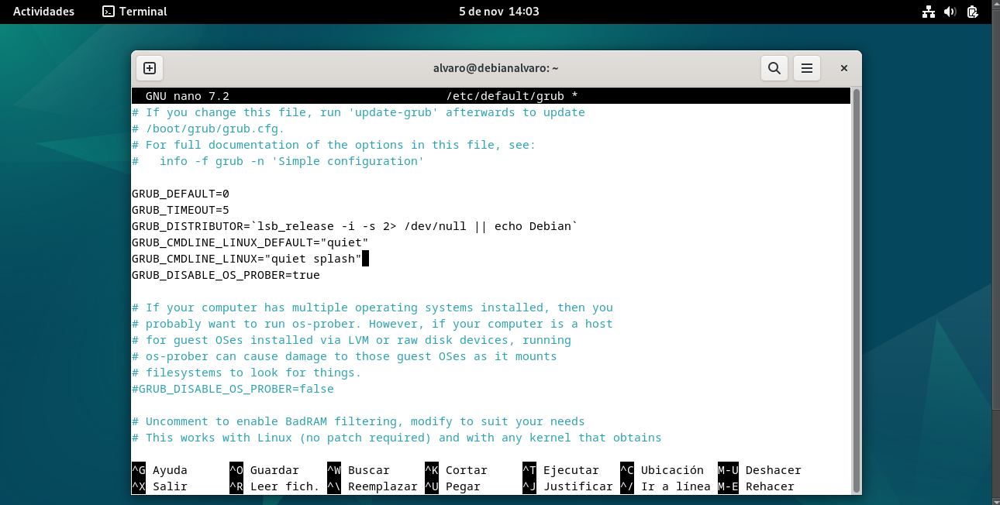

**Descripción:**

- ```GRUB_CMDLINE_LINUX="quiet splash"```: hace que el sistema arranque en modo "silencioso" y no muestre información detallada. Esto puede ayudar a evitar que detalles del sistema se muestren a posibles atacantes.

- ```GRUB_DISABLE_OS_PROBER=true```: desactiva el reconocimiento automático de otros sistemas operativos. Esto puede evitar que otros sistemas en el mismo disco sean añadidos al menú de GRUB, lo que fortalece el enfoque de seguridad al bloquear el acceso a otros sistemas desde GRUB.

<br>

Guardar los cambios y luego actualizar GRUB:
```bash
sudo update-grub
```

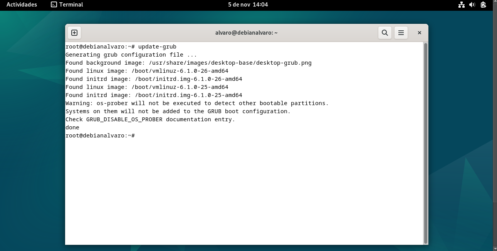

## Proteger el acceso a GRUB con contraseña
Configurar una contraseña en GRUB impide que usuarios no autorizados modifiquen las opciones de arranque o accedan al modo de recuperación sin tu permiso.

**Pasos:**

Generar una contraseña para GRUB:
```bash
sudo grub-mkpasswd-pbkdf2
```

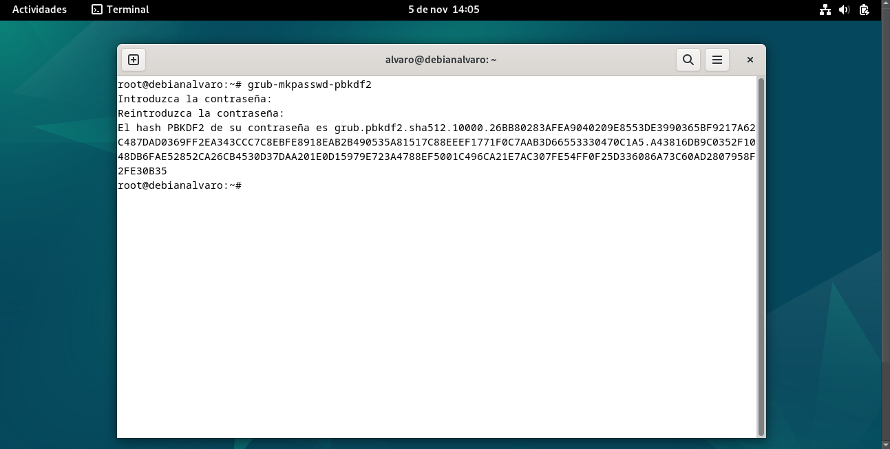

<br>

Copiar el hash generado.

<br>

Editar el archivo /etc/grub.d/40_custom para añadir usuario y contraseña:
```bash
sudo nano /etc/grub.d/40_custom
```
<br>

Añadir lo siguiente (se reemplaza miusuario por tu nombre de usuario y <contraseña generada> por el hash copiado):
```bash
set superusers="miusuario"
password_pbkdf2 miusuario <contraseña generada>
```

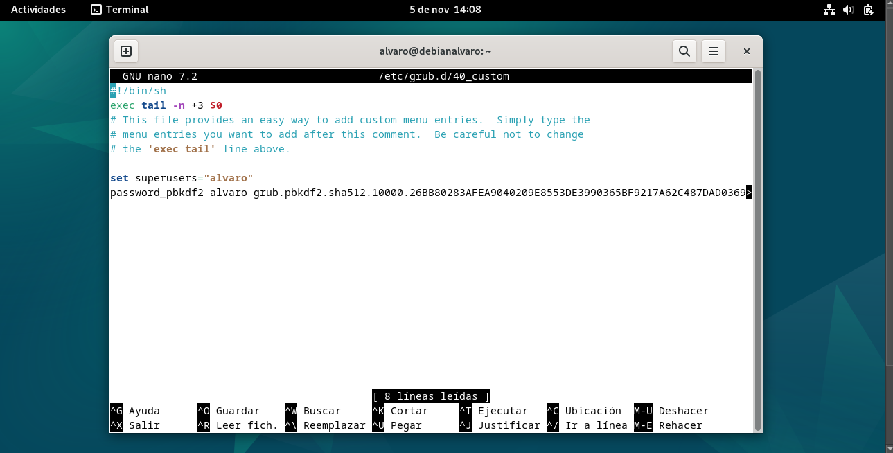

<br>

Guardar y actualizar GRUB para aplicar la contraseña:
```bash
sudo update-grub
```

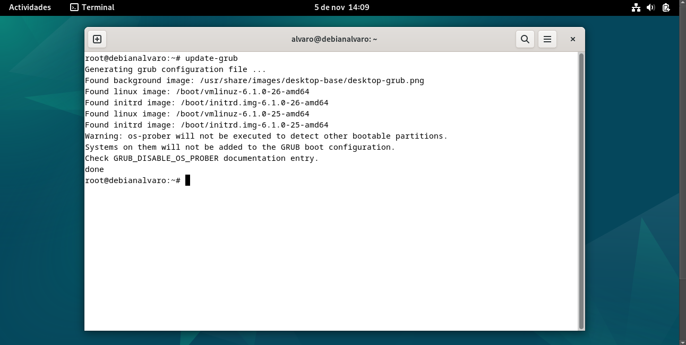


## Configurar AppArmor (Opcional)

AppArmor es un sistema de control de acceso que aplica políticas de seguridad y reduce el riesgo de comprometer procesos críticos.

**Pasos:**

Instalar AppArmor:
```bash
sudo apt install apparmor apparmor-utils
```

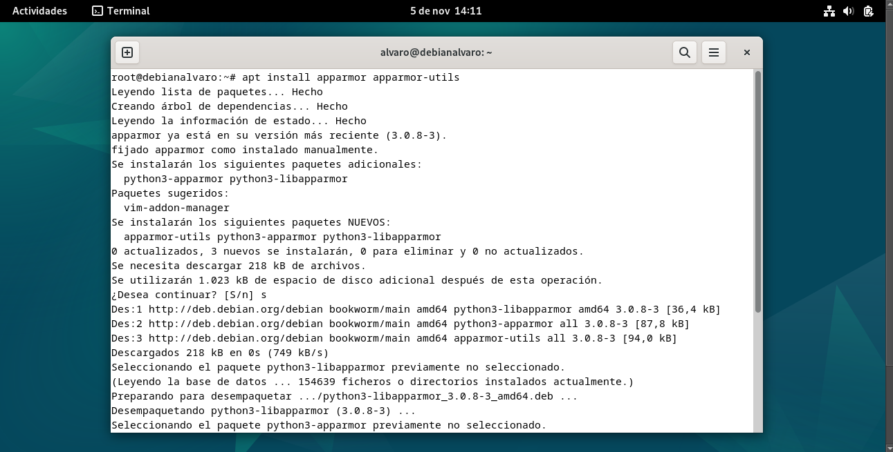

<br>

Activar AppArmor en el arranque:
```bash
sudo systemctl enable apparmor
```

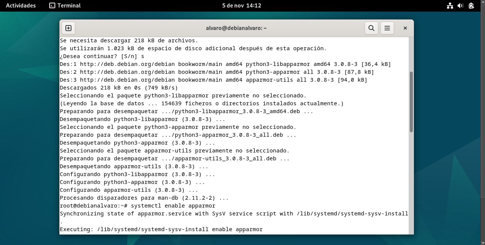


<br>

Para ver el estado y configurarlo para cada aplicación, usa:
```bash
sudo aa-status
```

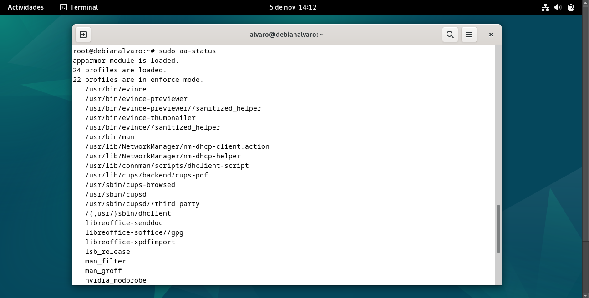

<br>

## Deshabilitar servicios innecesarios al arranque

Cada servicio que se inicia en el arranque es un posible punto de vulnerabilidad. Desactivar los servicios que no sean necesarios para reducir la superficie de ataque.

**Pasos:**

Listar los servicios que están habilitados en el arranque:
```bash
sudo systemctl list-unit-files --type=service
```

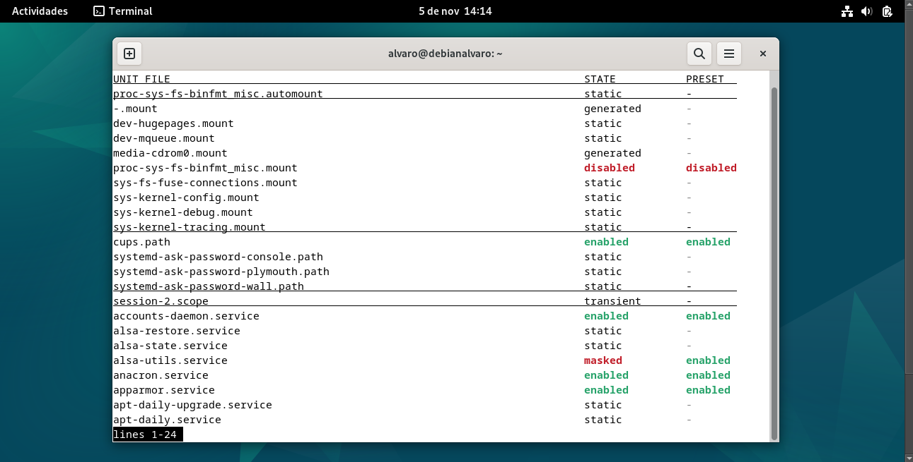

<br>

Desactivar los servicios innecesarios con:
```bash
sudo systemctl disable nombre_del_servicio
```

<br>

Por ejemplo, si no es necesario el servicio CUPS, se desactivaría de la siguiente manera:
```bash
sudo systemctl disable cups
```

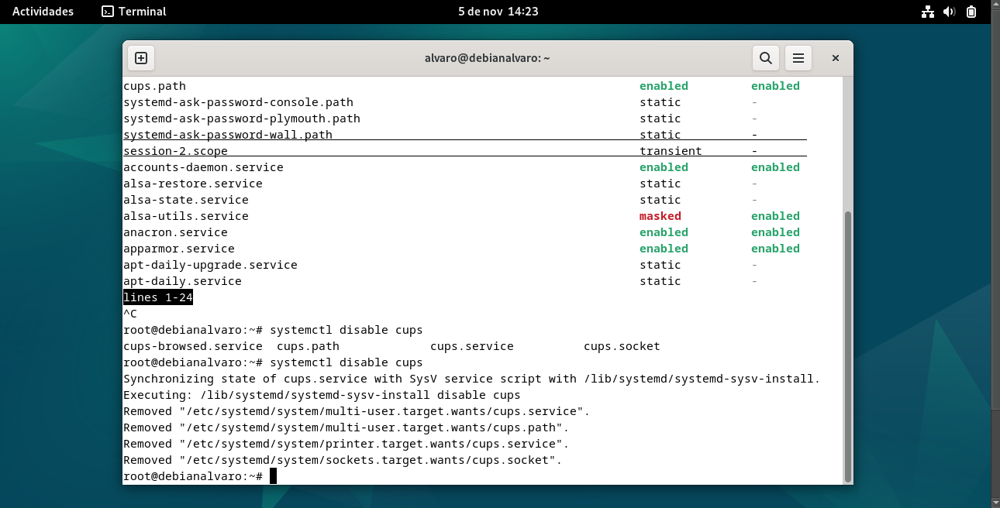

## Monitorear los logs de arranque
Revisar los registros del sistema ayuda a detectar intentos de acceso no autorizado o posibles problemas en el arranque.

**Comando:**
```bash
journalctl -b
```

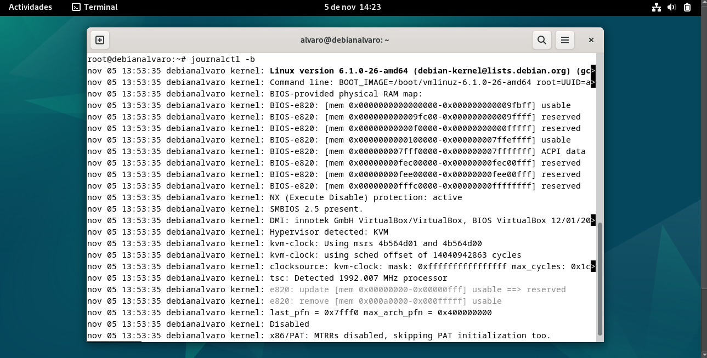

Este comando muestra el registro de eventos desde el último arranque.

## Conclusión
Implementar un bastionado efectivo en el arranque de un sistema Debian no solo fortalece la seguridad en una etapa temprana del funcionamiento del sistema, sino que también proporciona una base sólida para asegurar el entorno operativo en su totalidad. Cada medida de seguridad aplicada en esta guía aborda un posible vector de ataque, haciendo que el sistema sea más resistente a intentos de acceso no autorizado, modificación no deseada y ataques basados en el arranque.

Es fundamental recordar que la seguridad no es un estado estático; es un proceso continuo. A medida que los atacantes encuentran nuevas vulnerabilidades y técnicas, el bastionado de sistemas debe adaptarse y actualizarse para enfrentarse a las amenazas emergentes. Las configuraciones implementadas en esta guía deben revisarse y mejorarse regularmente, asegurando que Debian esté siempre protegido con las mejores prácticas de seguridad.

En conclusión, el bastionado del arranque en Debian sienta las bases de una arquitectura segura que salvaguarda la integridad y confidencialidad del sistema y sus datos. Mantener este nivel de seguridad no solo es esencial para proteger el sistema operativo, sino también para brindar confianza en el uso seguro y estable del entorno Debian en cualquier contexto, ya sea en servidores de producción, equipos personales o infraestructuras críticas.